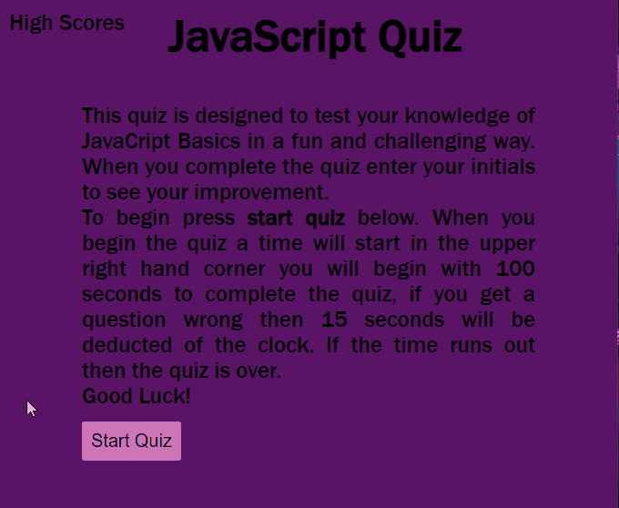

# JavaScript Coding Quiz 

## Technology Used 

| Technology Used         | Resource URL           | 
| ------------- |:-------------:| 
| HTML    | [https://developer.mozilla.org/en-US/docs/Web/HTML](https://developer.mozilla.org/en-US/docs/Web/HTML) |
| | [https://www.w3schools.com/html/html_basic.asp](https://www.w3schools.com/html/html_basic.asp)     | 
| CSS     | [https://developer.mozilla.org/en-US/docs/Web/CSS](https://developer.mozilla.org/en-US/docs/Web/CSS)      |
| | [https://www.w3schools.com/css/css_intro.asp](https://www.w3schools.com/css/css_intro.asp)     |    
| Git | [https://git-scm.com/](https://git-scm.com/)     | 
| JavaScript | [https://developer.mozilla.org/en-US/docs/Web/JavaScript](https://developer.mozilla.org/en-US/docs/Web/JavaScript)     | 
| | [https://www.w3schools.com/js/default.asp](https://www.w3schools.com/js/default.asp)     |   
| | [https://davidwalsh.name/event-delegate](https://davidwalsh.name/event-delegate)     | 
| | [https://www.youtube.com/watch?v=AUOzvFzdIk4](https://www.youtube.com/watch?v=AUOzvFzdIk4)     |   

## Description 

[Visit the Deployed Site](https://beckamcnally.github.io/quiz/)

JavaScript Coding Quiz is a web application that allows coding students to take a timed quiz on JavaScript fundamentals that stores high scores. The quiz is multiple-choice and the user is presented with a series of questions. If the user selects the correct answer, they move on to the next question. If the user selects the wrong answer, time is subtracted from the clock. At the end of the quiz, the user can save their initials and score to compare their progress to their peers.

## Table of Contents 

* [Usage](#usage)
* [Learning Points](#learning-points)
* [Author Info](#author-info)

## Usage
To use the application, simply click the "Start Quiz" button on the home page. Once the quiz has started, answer each multiple-choice question to the best of your ability. If you select the wrong answer, time will be subtracted from the clock. Once you have completed all the questions, or the timer reaches zero, the game will end. You will then be prompted to save your initials and score to compare your progress to your peers. You can view the high scores by clicking the "View High Scores" button on the home page.

## Learning Points 

* Using JavaScript to manipulate the DOM
* Using JavaScript to create and handle events
* Using JavaScript to manipulate local storage
* Working with timers in JavaScript
* Using CSS to create a responsive design

## Author Info

### Becka McNally 

* [Portfolio](https://beckamcnally.github.io/beckamcnally/)
* [LinkedIn](https://www.linkedin.com/in/becka-mcnally-21520670)
* [Github](https://github.com/beckamcnally)

